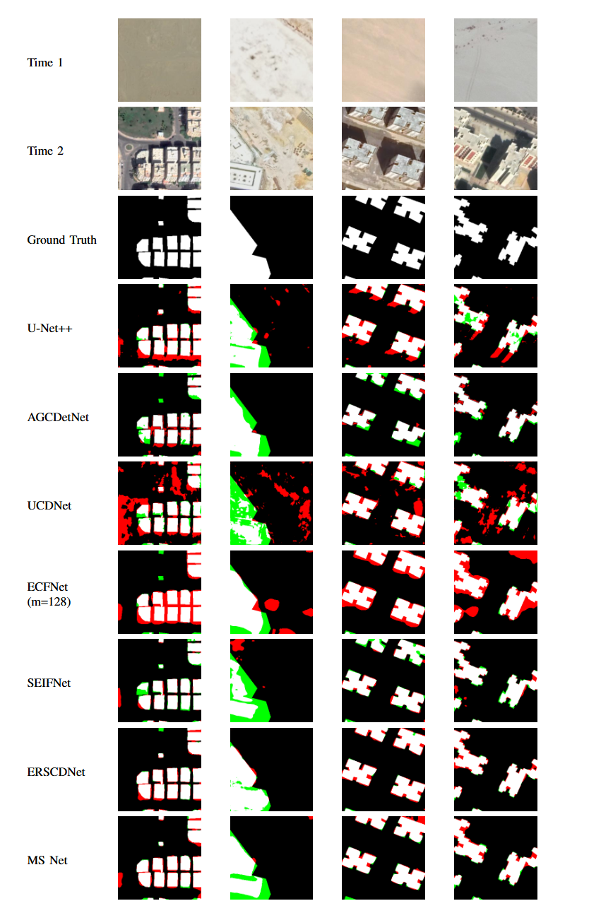
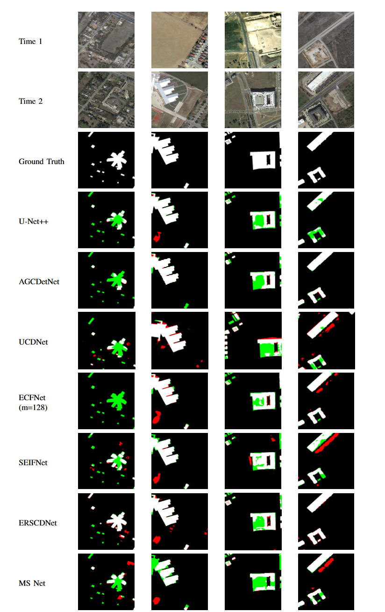

# Change Detection in Bi-Temporal Satellite Images

## Overview

This repository focuses on bi-temporal satellite image change detection using deep learning techniques.

The primary objective of this project is to design and develop a novel architecture capable of outperforming existing state-of-the-art (SOTA) models on standard change detection benchmarks. To establish a fair comparison, several leading architectures have been implemented and evaluated under consistent experimental settings.

The proposed model developed in this work is currently under review at the IEEE Journal of Selected Topics in Applied Earth Observations and Remote Sensing (IEEE JSTARS). Full architectural details and implementation will be released after the review process is completed.

The implementations provided here serve as strong baselines for comparative evaluation.

## Implemented Models

The following state-of-the-art architectures have been implemented and benchmarked:

- UNet++
- AGCDetNet
- UCDNet
- ECFNet
- SEIFNet
- ERSCDNet
- EGCDNet
- MSNet

## Datasets

### EGY-BCD Dataset

- 6091 bi-temporal image pairs  
- Resolution: 256 × 256  
- Regions: New Mansoura, El Falala City, New Cairo, New Thebes  
- Each pair includes a binary change mask  

A resized subset (512 × 512) was used for experimentation.

### LEVIR-CD Dataset

- 637 high-resolution bi-temporal image pairs  
- Spatial resolution: 0.5 m/pixel  
- Focus: building and structural change detection  

Images were patched to 512 × 512 for training and evaluation.

## Evaluation Metrics

All models are evaluated using:

- Precision  
- Recall  
- F1 Score  
- Intersection over Union (IoU)  
- Cohen’s Kappa  
- Overall Accuracy  
- Number of Parameters (Millions)  
- Average Prediction Time per Image (seconds)  

# Experimental Results

## EGY-BCD Dataset

| Model      | Precision | Recall | F1     | Kappa  | IoU    | Accuracy | Params (M) | Avg Time (s) |
|------------|------------|--------|--------|--------|--------|----------|------------|--------------|
| UNet++     | 0.4210     | 0.7465 | 0.5310 | 0.4116 | 0.3615 | 0.7924   | 4.9        | 0.6889       |
| AGCDetNet  | **0.8084** | 0.7656 | **0.7864** | **0.7749** | **0.6480** | **0.9782** | 48.1       | 0.8272       |
| UCDNet     | 0.4234     | 0.7278 | 0.5353 | 0.3979 | 0.3655 | 0.7719   | 1.3        | 0.6699       |
| ECFNet     | 0.6757     | **0.8083** | 0.7361 | 0.6735 | 0.5824 | 0.8573   | 24.6       | **0.6236**   |
| SEIFNet    | 0.7782     | 0.7615 | 0.7698 | 0.7197 | 0.6257 | 0.9178   | 19.8       | 0.7280       |
| ERSCDNet   | 0.6825     | 0.7975 | 0.7355 | 0.6815 | 0.5817 | 0.9097   | **1.1**    | 0.6355       |
| EGCDNet    | 0.7768     | 0.7191 | 0.7468 | 0.6937 | 0.5959 | 0.9022   | 71.7       | 0.6997       |
| MSNet      | 0.6728     | 0.6179 | 0.6442 | 0.5698 | 0.4751 | 0.8722   | 10.1       | 0.6952       |

## LEVIR-CD Dataset (Three Bands)

| Model      | Precision | Recall | F1     | Kappa  | IoU    | Accuracy | Params (M) | Avg Time (s) |
|------------|------------|--------|--------|--------|--------|----------|------------|--------------|
| UNet++     | **0.9133** | 0.7028 | 0.7943 | 0.7845 | 0.6588 | 0.9809   | 4.9        | 0.6870       |
| AGCDetNet  | 0.8166     | 0.7852 | 0.8006 | 0.7898 | 0.6675 | 0.9795   | 48.1       | 0.6120       |
| UCDNet     | 0.8697     | 0.8472 | 0.8583 | 0.8508 | 0.7517 | 0.9803   | 1.3        | 0.6715       |
| ECFNet     | 0.8393     | 0.8236 | 0.8313 | 0.8189 | 0.7114 | 0.9811   | 24.6       | 0.7426       |
| SEIFNet    | 0.8568     | 0.7999 | 0.8274 | 0.8181 | 0.7056 | 0.9178   | 19.8       | 0.6791       |
| ERSCDNet   | 0.8624     | **0.9300** | **0.8949** | **0.8889** | **0.8090** | **0.9885** | **1.1**    | **0.5869**   |
| EGCDNet    | 0.8286     | 0.8298 | 0.8242 | 0.8143 | 0.7009 | 0.9868   | 71.7       | 0.6217       |
| MSNet      | 0.8443     | 0.8048 | 0.8241 | 0.8148 | 0.7008 | 0.9715   | 10.1       | 0.6639       |

## Qualitative Evaluation

### EGY-BCD Visual Results

### LEVIR-CD Visual Results

## References

[1] D. Peng, Y. Zhang, and H. Guan, “End-to-end change detection for high resolution satellite images using improved UNet++,” Remote Sensing, vol. 11, no. 11, 2019.

[2] K. Song and J. Jiang, “AGCDetNet: An attention-guided network for building change detection in high-resolution remote sensing images,” IEEE Journal of Selected Topics in Applied Earth Observations and Remote Sensing, 2021.

[3] K. S. Basavaraju et al., “UCDNet: A deep learning model for urban change detection from bi-temporal multispectral Sentinel-2 satellite images,” IEEE Transactions on Geoscience and Remote Sensing, vol. 60, pp. 1–10, 2022.

[4] S. Zhu et al., “ECFNet: A siamese network with fewer FPs and fewer FNs for change detection of remote-sensing images,” IEEE Geoscience and Remote Sensing Letters, vol. 20, 2023.

[5] Y. Huang et al., “Spatiotemporal enhancement and interlevel fusion network for remote sensing image change detection,” IEEE Transactions on Geoscience and Remote Sensing, vol. 62, 2024.

[6] S. N et al., “A robust CNN framework for change detection analysis from bitemporal remote sensing images,” IEEE Journal of Selected Topics in Applied Earth Observations and Remote Sensing, vol. 17, pp. 12637–12648, 2024.

[7] C. You et al., “High-resolution remote sensing change detection with edge-guided feature enhancement,” IEEE Geoscience and Remote Sensing Letters, vol. 22, 2025.

[8] S. Liu et al., “Network and dataset for multiscale remote sensing image change detection,” IEEE Journal of Selected Topics in Applied Earth Observations and Remote Sensing, 2025.

[9] H. Chen and Z. Shi, “A Spatial-Temporal Attention-Based Method and a New Dataset for Remote Sensing Image Change Detection,” Remote Sensing, vol. 12, p. 1662, 2020.

[10] S. Holail et al., “AFDE-Net: Building change detection using attention-based feature differential enhancement for satellite imagery,” IEEE Geoscience and Remote Sensing Letters, vol. 20, 2023.
