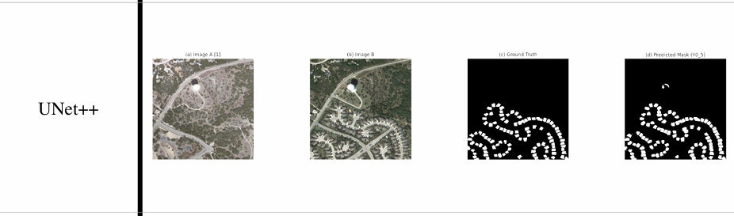

# Change Detection in Satellite Images  

## Technologies and Tools Used  
- Python (TensorFlow / Keras)  
- Jupyter Notebooks (`.ipynb`)  
- Deep Learning models for Change Detection  
- Git & GitHub for version control  

---

## Features of the Work  

- Implemented **six state-of-the-art models** for **bi-temporal satellite image change detection**.  
- Each model is implemented as a **separate Jupyter Notebook**, focusing on architectural details from the original research papers.  
- Evaluations include **Accuracy, Precision, Recall, F1-score, IoU, and Cohen’s Kappa**.  
- Tested primarily on the **LEVIR-CD dataset** for building and land-use change detection.  
- Organized results for easy understanding and comparison between different models.  

---
 ## Implemented Models for Change Detection :

- **Improved UNet++ – End-to-End Change Detection for High-Resolution Satellite Images**  
  - Based on *Peng et al. [2]*, extending UNet++ for change detection by treating image pairs as multi-channel inputs.  
  - Introduces **Multiple Side Output Fusion (MSOF)** for combining predictions from different semantic levels.  
  - Captures both **local fine changes** and **global structural shifts**, reducing false positives.  
  - **Limitation**: Struggles with very small-scale or subtle changes in high-resolution imagery.  

- **AGCDetNet – Attention-Guided Network for Building Change Detection**  
  - Inspired by *Rustamov et al. [3]*, designed for **building-level change detection**.  
  - Employs **Spatial Pixel-level Attention Module (SPAM)** to emphasize change-related features.  
  - Uses **Cross-scale Feature Integration Unit (CIFU)** and **Context-Guided ASPP (CG-ASPP)** for robust multi-scale learning.  
  - **Strength**: Excels in complex **urban environments**.  
  - **Weakness**: Performance drops on medium/low-resolution imagery.  

- **UCDNet – Deep Learning Model for Urban Change Detection**  
  - From *Basavaraju et al. [5]*, designed for **urban monitoring with Sentinel-2 data**.  
  - Siamese encoder–decoder with **Modified Residual Connections** for stability.  
  - Adds **New Spatial Pyramid Pooling (NSPP)** for multi-scale urban structure detection.  
  - Uses a **hybrid loss** (Weighted Cross-Entropy + Modified Kappa Loss) to reduce FP/FN.  
  - Highly effective for **urban change detection tasks**.  

- **ECFNet – Siamese Network with Fewer False Positives/Negatives**  
  - From *Liu et al. [6]*, also called **Edge-Conditioned Feature Fusion Network**.  
  - Integrates **auxiliary edge detection** for preserving boundaries.  
  - Performs **dual-stage fusion** of semantic + edge features for sharper predictions.  
  - Strong in **boundary-sensitive areas** like roads and buildings.  
  - **Trade-off**: Higher computational demand.  

- **SEIFNet – Spatiotemporal Enhancement and Interlevel Fusion Network**  
  - Proposed by *Zhang et al. [7]*, also known as **Semantic Edge Information Fusion Network**.  
  - Runs **parallel semantic + edge branches** to capture both context and structure.  
  - Uses a **Feature Aggregation Module (FAM)** to refine predictions and suppress noise.  
  - **Advantage**: Reduces **false alarms and over-detection**.  
  - **Limitation**: Needs **high-quality edge supervision**.  

- **Robust CNN Framework – Baseline for Bi-temporal Change Detection**  
  - Based on *Daudt et al. [1]*, introducing **FC-Siam-conc** and **FC-Siam-diff** models.  
  - Siamese encoders merge temporal features via **concatenation** or **differencing**.  
  - Retains **fine spatial localization** with skip connections.  
  - Provided the **first strong CNN baseline** for bi-temporal change detection.  
  - **Weakness**: Struggles with **complex semantics** and **subtle changes**.  
---
##  Visualization of Results

  
 

  

  

---
##  Experimental Results

We evaluated multiple state-of-the-art change detection models on the LEVIR-CD dataset.  
The table below shows the comparison in terms of **Kappa, F1, IoU, Precision, and Recall**:

| Method     | Kappa (%) | F1 (%) | IoU (%) | Precision (%) | Recall (%) |
|------------|-----------|--------|---------|---------------|------------|
| UNet++     | 78        | 79     | 65      | 91            | 70         |
| AGCDetNet  | 78        | 80     | 66      | 81            | 78         |
| UCDNet     | 85        | 85     | 75      | 86            | 84         |
| ECFNet     | 81        | 80     | 69      | 81            | 82         |
| SEIF-Net   | 83        | 84     | 72      | 87            | 80         |
| ERSCD-Net  | **89**    | **89** | **81**  | 87            | **92**     |

**ERSCD-Net achieved the best performance**, outperforming others in Kappa, F1, IoU, and Recall.

---

##  Dataset  

- **LEVIR-CD**: Large-scale remote sensing dataset for change detection.  
  - 637 pairs of **1024×1024** bitemporal images (Google Earth, 2002–2018).  
  - 5% of pixels represent **changed areas** (foreground).  
  - Highly imbalanced → requires tailored loss functions.  

 Dataset link: [LEVIR-CD on Kaggle](https://www.kaggle.com/datasets/mdrifaturrahman33/levir-cd)  
---
##  References  

These models are grounded in the following foundational works:  

- **Peng et al. (2019)** – *End-to-End Change Detection for High-Resolution Satellite Images Using Improved UNet++*, Remote Sensing, 11(11): 1382.  
  [[Paper Link](https://www.mdpi.com/2072-4292/11/11/1382/notes?utm_source=chatgpt.com)]  
- **IEEE publications** for the other models include:  
  - **AGCDetNet** – IEEE Xplore ID: [9423508](https://ieeexplore.ieee.org/document/9423508)  
  - **UCDNet** – IEEE Xplore ID: [9740122](https://ieeexplore.ieee.org/document/9740122)  
  - **ECFNet** – IEEE Xplore ID: [10023508](https://ieeexplore.ieee.org/document/10023508)  
  - **SEIFNet** – IEEE Xplore ID: [10419228](https://ieeexplore.ieee.org/document/10419228)
---

